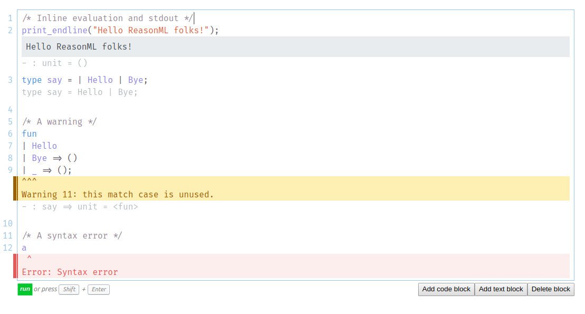

# ReasonML playground

A note writing application for teaching and sharing ReasonML code with inline evaluation.

## How does it work?

This project uses [rtop-evaluator](https://github.com/Sketch-sh/rtop-evaluator) for evaluating the input

## Contributions

See [DEVELOPING.md](https://github.com/Sketch-sh/sketch-sh/blob/master/DEVELOPING.md) for more information

## LICENSE

Apache 2.0. See the included LICENSE file for more information
