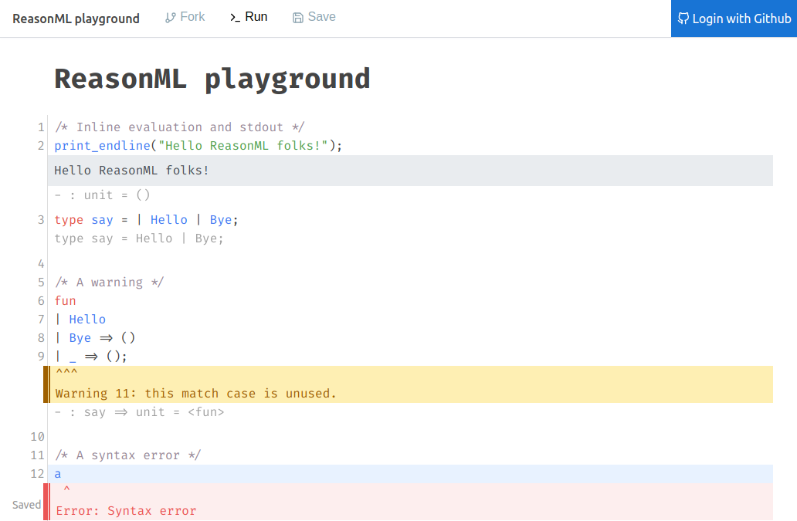

# Sketch.sh

Online Code Editor and ReasonML community

## Links

- Website: [https://sketch.sh](https://sketch.sh)
- Documentation: [https://sketch.sh/docs](https://sketch.sh/docs)
- Beta with bucklescript support: [https://beta.sketch.sh](https://beta.sketch.sh)

## Contributions

See [DEVELOPING.md](https://github.com/Sketch-sh/sketch-sh/blob/master/DEVELOPING.md) for more information

## LICENSE

Apache 2.0. See the included LICENSE file for more information
